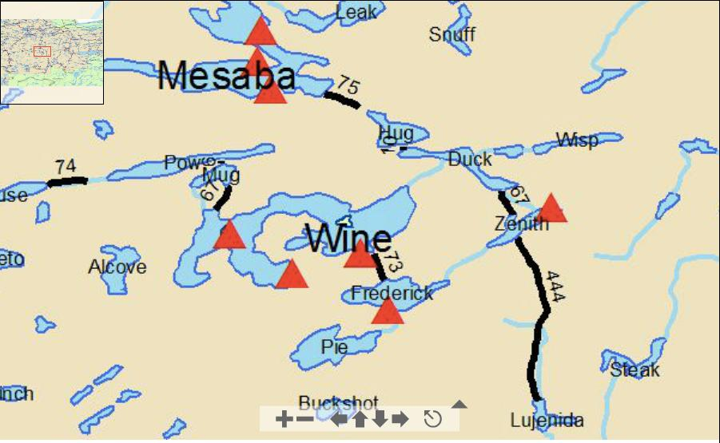

# Kanoe (qayıq) Daşınması

## Assignment Overview
Bu tapşırıqda əsasən riyazi hesablamalar etmək tələb olunur.

## Background
Bu proyektdə siz ***input*** və ***print*** funksiyalarından və bəzi sadə riyazi funksiyalardan istifadə edəcəksiniz.

## Program Specifications
Konvertasiyalar həm elmdə həm də gündəlik həyatımızda faydalıdır. Bu tapşırıqda biz bəzi məsafə konvertasiyaları edəcəyik.
Əgər siz [Boundary Waters Canoe Area](https://www.google.com/maps/place/The+Boundary+Waters+Canoe+Area+Wilderness/@47.9203686,-91.2523556,15z/data=!4m5!3m4!1s0x0:0x46b42d90b4864fce!8m2!3d47.9203686!4d-91.2523556) ərazisində qayıq sürmək istəsəniz onda göllər arasında qayığınızı daşımalı olacaqsınız. Aşağıda göllərin xəritəsi verilmişdir:

Xəritədə göllər arasında daşınmalar qara xətlərlə göstərilmişdir. Ölçü vahidi isə ROD (1 rod == 5.0292 metr) ilə verilmişdir. Qırmızı üçbucaqlar isə kampların yerləşmə nöqtələridir.

Proqram istifadəçidən ROD ilə məsafə daxil etməsini tələb etməlidir. Daxil olunan məsafə kəsr ədədi ilə ola bilər. Siz ROD ilə daxil edilən məsafəni aşağıdakı uzunluq vahidlərinə çevirərək göstərməlisiniz:

* metr
* feet
* mil
* furlong
* daxil edilən məsafəni dəqiqə ilə nə qədər vaxta qət etmək olar?

Konvertasiya zamanı aşağıdakı məlumatlardan istifadə edə bilərsiniz:

* 1 rod = 5.0292 metr
* 1 furlong = 40 rod
* 1 mil = 1609.34 metr
* 1 foot = 0.3048 metr
* məsafə qət etmə sürəti ortalama 3.1 mil / saatdır

---

***Powered by [Elşad Ağazadənin Proqramlaşdırma Məktəbi](https://elshadaghazade.com)***

***Originally posted by Elshad Agayev***

***Please follow instructions on how you should solve this task***