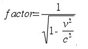
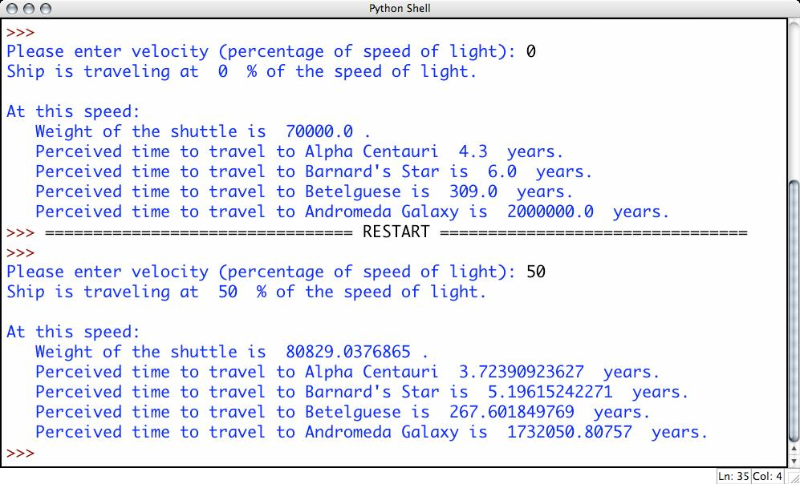

# Zaman Səyahəti

Eynşteynin nisbilik nəzəriyyəsinə görə cisim nə qədər sürətli hərəkət edərsə, onda onun çəkisi sürət faktoruna görə artar, zaman axışı isə yavaşlayar. Sürət faktorunun hesablanması aşağıdakı düsturla aparılır:

Burada **v** cismin sürətidir, **c** isə işıq sürətidir və 299,792,458 metr/saniyəyə bərabərdir.

## Program Specification

Sizin proqramınız istifadəçidən cismin sürətinin işıq sürətinin neçə faizi olduğunu daxil olunmasını tələb etməlidir. Daha sonra faktoru hesablayaraq cismin çəkisini və aşağıdakı planetlərə və qalaktikalara çatacaq vaxtı hesablamalıdır:

* Alpha Centauri: 4.3 işıq ili
* Barnard’s Star: 6.0 işıq ili
* Betelgeuse (Samanyolu qalaktikasındadır): 309 işıq ili
* Andromeda Qalaktikası (Bizə ən yazın qalaktika): 2,000,000 işıq ili

Nümunə:

---

***Powered by [Elşad Ağazadənin Proqramlaşdırma Məktəbi](https://elshadaghazade.com)***

***Originally posted by Elshad Agayev***

***Please follow instructions on how you should solve this task***