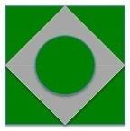
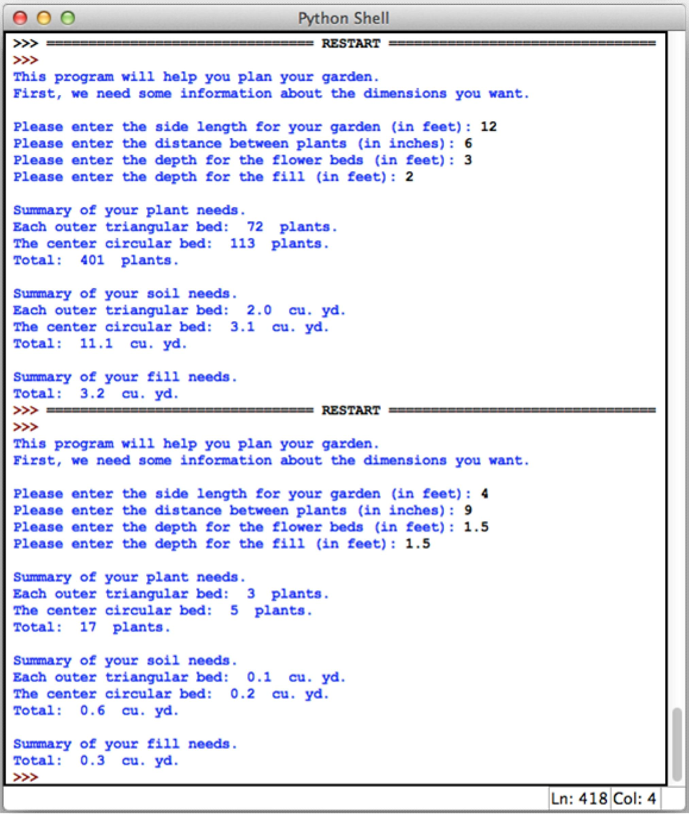

# Ornamental Bağ

Aşağıdakı şəkildə gördüyünüz fiqur bağçanın salınacağı ərazidir. Bağ kvardat formadadır. Yaşıl rənglə çəkilmiş ərazilər güllərin salınacağı yerdir. Boz rənglə çəkilmiş ərazilər isə kafelin qoyulacağı yerdir. Güllərin basdırılacağı yerlərə qum sərf olunacaq. Ortada olan yumru ərazinin diametri bağın bir divarının yarısı qədərdir.

## Program Specification

Sizin proqram istifadəçidən aşağıdakı məlumatları tələb etməlidir:

* Bağın bir kənarının uzunluğunu
* Güllər arasında məsafələr
* Gülün basdırılacağı yerin dərinliyi
* Boz yerlərin dərinliyi

Daha sonra proqram aşağıdakı hesablamaları edərək print etməlidir:

* Hər yaşıl fiqur üçün əkiləcək güllərin sayı və ümumi bağ üçün əkiləcək güllərin sayı
* Əkiləcək hər gül üçün neçə kub metr qum sərf olunacaq, həmçinin bütün bağ üçün neçə kub metr qum sərf olunacaq
* Bütün bağ üçün sərf ediləcək kafelin kub metr ilə ölçüsü

Nümunə:

---

***Powered by [Elşad Ağazadənin Proqramlaşdırma Məktəbi](https://elshadaghazade.com)***

***Originally posted by Elshad Agayev***

***Please follow instructions on how you should solve this task***