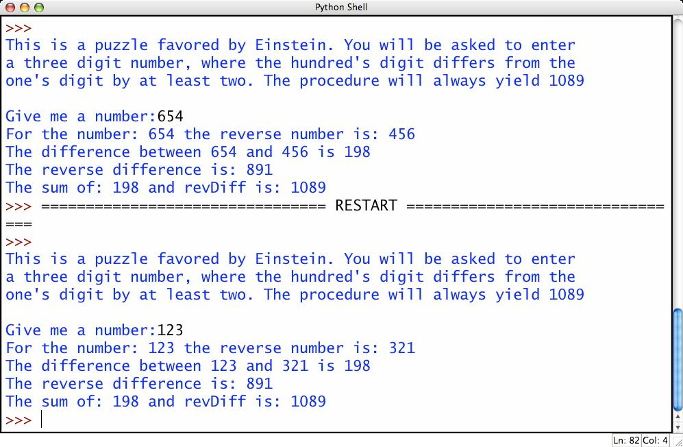

# Eynşteyn Üsulu ilə Zehin Oxuma

Eynşteyn dostlarını təəccübləndirmək üçün fikirləşdiyi oyunun qaydaları aşağıdakı kimidir:

1. Dostunuzdan 3 rəqəmli ədəd fikirləşməsini istəyin. Elə qəbul edək ki, onun fikirləşdiyi ədəd 654 olacaq.
2. Daha sonra bu rəqəmi tərsinə (reverse) çevirməyi istəyin (654 -> 456 olacaq)
3. Kiçik olandan böyük olanı çıxın (654 - 456 = 198)
4. Fərqdən alınan yeni rəqəmi də tərsinə çevirməyi istəyin (198 -> 891 olacaq)
5. Daha sonra sonuncu iki rəqəmi toplamasını istəyin, alınan cavab 1089 olacaq (198 + 891 = 1089)

Maraqlısı budur ki, istənilən 3 rəqəmli integer üzərində bu əməliyyatları aparanda nəticədə 1089 alınacaq

## Program Specification
Sizin proqram aşağıdakıları etməlidir:

1. İstifadəçiyə oyun haqda qaydaları izah edən mesaj çıxartmalıdır
2. İstifadəçidən 3 rəqəmli ədəd daxil etməyini tələb etməlidir, əgər istifadəçi fərqli bir şey daxil etsə dərhal onu xəbərdar etməlidir və yenidən 3 qərəmli ədəd daxil etməyisini istəməlidir. Bu hal istifadəçi doğru daxil edənə qədər davam etməlidir.
3. İstifadəçinin daxil etdiyi rəqəmi və onun tərsini (reversed) print etməlidir.
4. Böyük ədəddən kiçiyi çıxaraq alınan nəticə print olunmalıdır.
5. Alınan fərqi tərsinə çevririn (reversed) və yenidən print edin.
6. Sonuncu iki rəqəmin cəmini print edin. Bu hər zaman 1089 olacaq.

Nümunə:

---

***Powered by [Elşad Ağazadənin Proqramlaşdırma Məktəbi](https://elshadaghazade.com)***

***Originally posted by Elshad Agayev***

***Please follow instructions on how you should solve this task***