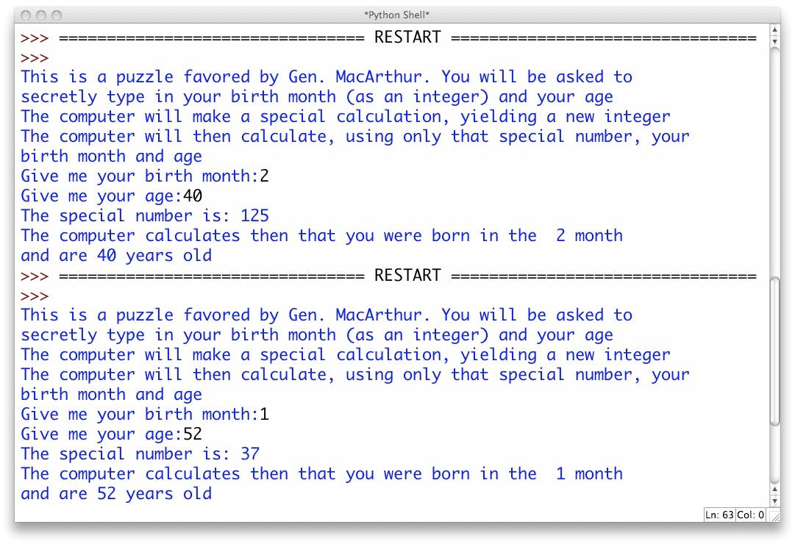

# General Douglas MacArthur-un sehrbazlığı

General Douglas MacArthur gəncləri maraqlı sehrbazlıqlarla təəccübləndirmək üçün aşağıdakı qaydaları edirdi:

* İştirakçıdan doğulduğu ayın rəqəmini yadda saxlamağı istəyir. Misalçün fevral ayında doğulmuşdursa onda bu rəqəm 2 olacaq.
* Həmən rəqəmi iki dəfə artırmaq. (2 * 2 = 4)
* Üzərinə 5 əlavə etmək (4 + 5 = 9)
* Alınan rəqəmi 50-yə vurmaq (9 * 50 = 450)
* Alınan rəqəmin üzərinə iştirakçının öz yaşını gəlməsini istəyir. (Misalçün əgər iştirakçının yaşı 40-dırsa onda 450 + 40 = 490)
* Alınan rəqəmdən 365 çıxmasını istəyir və alınan rəqəmi səsləndirməsini istəyir (490 - 365 = 125)
* Sonda General eşitdiyi rəqəmin üzərinə xəyalında 115 əlavə edərək alınan rəqəmin son iki hissəsi ilə iştirakçının yaşını tapır, qalan hissəsi ilə hansı ayda doğulduğunu tapır. (125 + 115 = 240. Burada 2 fevral ayını göstərir, 40 isə iştirakçının yaşını)

## Program Specification

Sizin proqram MacArtur oyununu aşağıdakı kimi oynamalıdır:

1. Oyun haqda qısa məlumatı istifadəçiyə print etməlidir
2. İstifadəçidən həm doğulduğu ayı, həm də yaşını daxil etməsini istəməlidir
3. Daxil edildikdən sonra istifadəçinin daxil etdiyi məlumatların rəqəm olub olmaması, ayın rəqəminin 1 ildə olan ayların sayından az və ya çox olmamasını və s. yoxlamalıdır. Əgər səhv varsa onda istifadəçini xəbərdar edərək yenidən daxil etməsini tələb etməlidir. Bu hal istifadəçi doğru yazana qədər davam edəcək
4. Hesablamalar zamanı alınan "xüsusi" rəqəmi print edin
5. Daha sonra proqramınız "xüsusi" rəqəmin üzərinə 115 gələrək alınan rəqəmdən onun doğulduğu ayın rəqəmini və yaşını ayırmalıdır və print etməlidir

Nümunə:

---

***Powered by [Elşad Ağazadənin Proqramlaşdırma Məktəbi](https://elshadaghazade.com)***

***Originally posted by Elshad Agayev***

***Please follow instructions on how you should solve this task***