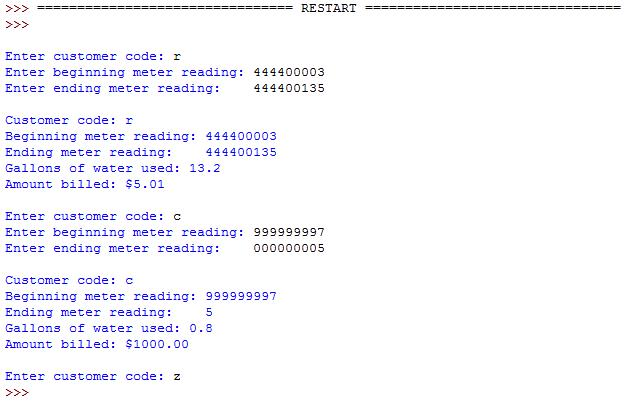

# Water billing

Su satışı ilə məşğul olan firmanın müştəriyə görə su satışlarını hesablayan proqram yazmalısınız.

Firmanın istifadəçiləri üç kateqoriyaya aid edilir: əhali, kommersial və istehsalat. Hər kateqoriya üçün qiymətlər fərqlidir. Onlar aşağıdakı kimidir:

1. Residential - əhali (r simvolu ilə qeyd ediləcək)
    * $5 dollar və hər gallon üçün $0.0005 dollar
2. Commercial (c simvolu ilə qeyd ediləcək)
    * 4 milyon gallona qədər $1000 dollar və hər əlavə gallon üçün $0.00025 dollar 
3. İndustrial - istehsalat (i simvolu ilə qeyd ediləcək)
    * 4 milyon gallon-a qədər $1000 dollar, 4 milyon gallon-dan 10 milyon gallona qədər $2000 dollar. Əgər 10 milyon gallonu aşarsa onda hər gallon üçün $0.00025 dollar.

## Program Specification

Sizin proqram aşağıdakıları etməldir:

1. İstifadəçidən kateqoriyasının kodunu soruşmalıdır. Əgər istifadəçi doğru kateqoriya daxil etməyibsə onda yenidən soruşmalıdır.
2. Əgər istifadə **q** hərfi daxil etdisə onda proqram çıxış etməlidir.
3. İstifadəçidən sayğacın suyu istifadə etməmişdən qabaq olan göstəricisini soruşmalıdır
4. İstifadəçidən sayğacın sudan istifadə etdikdən sonra olan göstərisini soruşmalıdır
5. İstifadə edilən suyun miqdarını gallon ilə göstərmək
6. İstifadəçinin borcunu göstərmək və yenidən əvvələ qayıtmaq.

## Assignment Notes

1. İstifadəçinin daxil etdiyi kateqoriya simvolu böyük və ya kiçik hərf ola bilər. Bunu nəzərə almaq lazımdır.
2. Sayğacın maksimum göstəricisi doqquz rəqəmli ədəddir (999999999)
3. Sayğacın hər bir rəqəmi 10 gallon suya bərabərdir. Misal: 444400003 ilə 444400135 arasında 132 fərq var. Bu da 13.2 gallon su deməkdir.
4. Əgər sayğacın maksimum göstəricisi aşılarsa onda sayğac hesablamanı sıfırdan aparacaq. Misal: 999999997 üzərinə 0.8 gallon (8 ədədi) gəldikdə onda sayğacın göstəricisi 000000005 edəcək. İstifadəçi məlumat daxil edərkən bunu yoxlamağı unutmayın

## Nümunə

