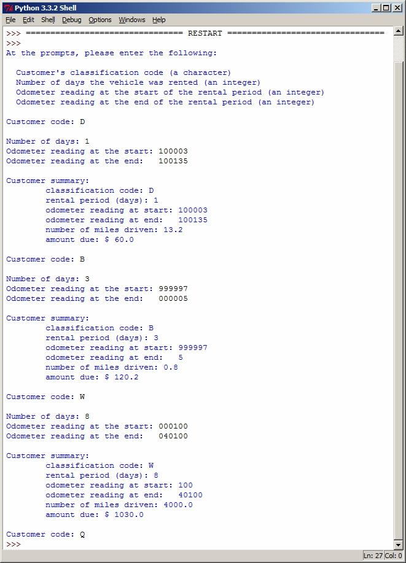

# Car Rental

Avtomobil icarəyə verən firma üçün müştərinin borcunu hesablayan proqram yazın.

Firma icarəyə verdiyi avtomobillərin borcunu üç kateqoriyaya əsasən fərqli qiymətlərlə hesablayır

1. Budget - b simvolu ilə qeyd ediləcək
    * Hər gün üçün $40 dollar tutulur, hər sürülən milə görə əlavə $0.25 dollar pul tutulur
2. Daily - d simvolu ilə qeyd ediləcək
    * Hər gün üçün $60 dollar tutulur, əgər gündəlik sürülən məsafə 100 mili keçməyibsə onda əlavə ödəniş tələb olunmur. Əks halda hər əlavə sürülən milə görə $0.25 dollar tutulur.
3. Weekly - w simvolu ilə qeyd ediləcək
    * Həftəlik $190 dollar tutulur. Əgər həftəlik sürülən məsafə 900 mili keçməyibsə onda əlavə ödəniş tələb olunmur.
    * Əgər həftəlik məsafə 900 mildən 1500 milə qədər olubsa onda həftəlik ödənişə $100 dollar əlavə olunur
    * Əgər həftəlik sürüş 1500 mili keçmişdirsə onda həftəlik ödəniş $200 dollar və 1500 mildən artıq məsafənin hər milinə görə $0.25 dollar tutulmalıdır.

## Program Specification

Sizin proqram aşağıdakıları etməldir:

1. İstifadəçidən kateqoriyasının kodunu soruşmalıdır. Əgər istifadəçi doğru kateqoriya daxil etməyibsə onda yenidən soruşmalıdır.
2. Əgər istifadə **q** hərfi daxil etdisə onda proqram çıxış etməlidir.
3. İstifadəçidən sayğacın ilkin göstəricisini qeyd etməsini tələb etməlidir.
4. İstifadəçidən sayğacın son göstəricisini qeyd etməsini tələb etməlidir.
5. İstifadəçidən günlərin sayını daxil etməsini tələb etməlidir.
6. Gedilən məsafəni print etməlidir.
7. İstifadəçinin borcunu göstərmək və yenidən əvvələ qayıtmaq.

## Assignment Notes

Daxil edilən və alınan məbləğlər 1 sentə qədər yuvarlaqlaşdırılmalıdır.

## Nümunə

