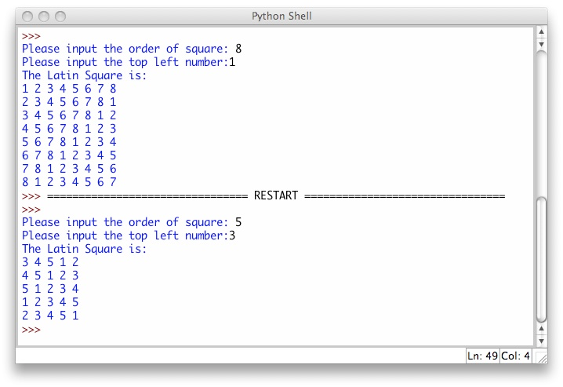

# Latin Square

Bu proqram Latın kvadratı aşağıdakı kimi latın kvadratı yaratmalıdır:

## Program Specification

Proqram istifadəçidən növbə ilə iki rəqəm daxil etməsini istəməlidir. Birinci rəqəm kvadratın ölçüsü olacaq. İkinci rəqəm isə kvadratın yuxarı sol küncündən başlayacaq rəqəmdir. İkinci rəqəm 1-dən birinci daxil edilən rəqəm arasında olmalıdır.

## Nümunə:

