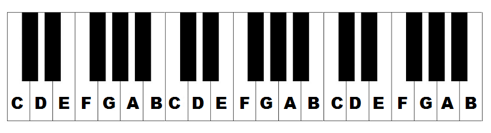
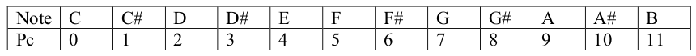
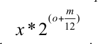
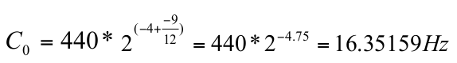
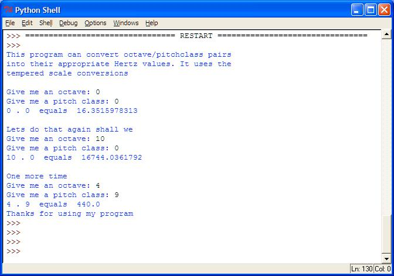

# Tones

Pianoda oktavalar 4 eyni tonlu qruplara bölünür. Hər qrupda isə 12 oktava var.

Misalçün 5.9 yazıldıqda 9-cu qrupdakı 5-ci oktava nəzərdə tutulur (sıra sayı sıfırdan başlayır)

## Assignment Overview

Musiqidə qədim problemlərdən biri pianoda olan klaviaturaların Herz ilə səs tonlarını ayarlamaqdır. Bunun üçün Aşağıdakı formuladan istifadə edilir:

Burada **x** qəbul edilən ortalama tezlikdir. **o** oktavanın eyniton qrupunun sağdan sola olan sırasıdır. **m** isə eyni qrupda oktavanın sağdan sola sırasıdır. Misal üçün, əgər 0.0 verilmişdirsə onda bu 0-cı qrupun 0-cı oktavasıdır (C), hansı ki, 4 qrup və 9 oktava aşağıdır *(x = -4, o = -9)*. Əgər otalama herz 440 götürülsə onda yuxarıdakı formulaya əsasən biz:

## Program Specifications

Sizin proqram aşağıdakıları etməlidir:

1. Proqram ilk dəfə run olunubsa onda istifadəçiyə proqram haqqında qısa məlumat verməlidir.
2. Proqram istifadəçidən 3 dəfə qoşa rəqəmlər daxil etməsini tələb etməlidir. Qoşa rəqəmlər uyğun olaraq oktava və qrupu göstərir.
3. Proqram hər üç qoşanın tezliyini hesablayaraq print etməlidir, həmçinin yuxarıdakı cədvələ əsasən oktavanın hərf qarşılığını və qrupun nömrəsini də print etməlidir.

Nümunə:

---

***Powered by [Elşad Ağazadənin Proqramlaşdırma Məktəbi](https://elshadaghazade.com)***

***Originally posted by Elshad Agayev***

***Please follow instructions on how you should solve this task***