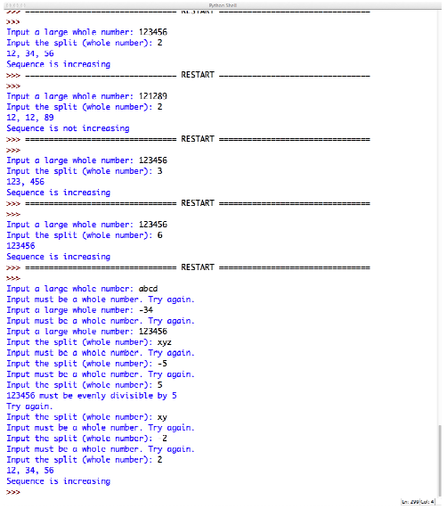

# Number Puzzle

Bu proqram istifadəçinin daxil etdiyi rəqəmi eyni sayda hissələrə parçalayaraq onların artan sırada olub olmadığını bildirməlidir.

## Program Specification

Proqram istifadəçidən aşağıdakıları etməlidir:

1. İstifadəçiyə proqram haqda qısa məlumat verməlidir
2. İstifadəçidən input vasitəsi ilə müsbət ədəd daxil etməsini istəməlidir
3. Əgər istifadəçi mənfi ədəd və ya qeyri rəqəm simvollar daxil edərsə onda istifadəçini xəbərdar edərək yenidən təkrarlamasını tələb etmək. Bu hal doğru dəyər daxil edilənə qədər təkrarlanmalıdır.
4. İstifadəçidən əvvəlki daxil etdiyi ədədi neçə yerə bölmək istədiyini soruşmalıdır. İstifadəçi bu halda da müsbət ədəd daxil etməlidir. Əks halda xəbərdarlıq edilərək doğru cavab yazılana qədər soruşulmalıdır. Əgər:
    - İstifadəçinin birinci daxil etdiyi ədəd ikinci ədəd qədər bərabər hissələrə parçalana bilmirsə onda istifadəçidən yenidən ikinci rəqəmi daxil etməsi istənilməlidir
    - İstifadəçinin birinci daxil etdiyi ədəd ikinci ədəd qədər bərabər hissələrə parçalana bilirsə onda onları ardıcıl olaraq yoxlamaq lazımdır. Əgər onlar artan sıradadırsa onda **Artandır** sözü yazılmalıdır. Əks halda **Artan deyil** yazılmalıdır

## Nümunə:

