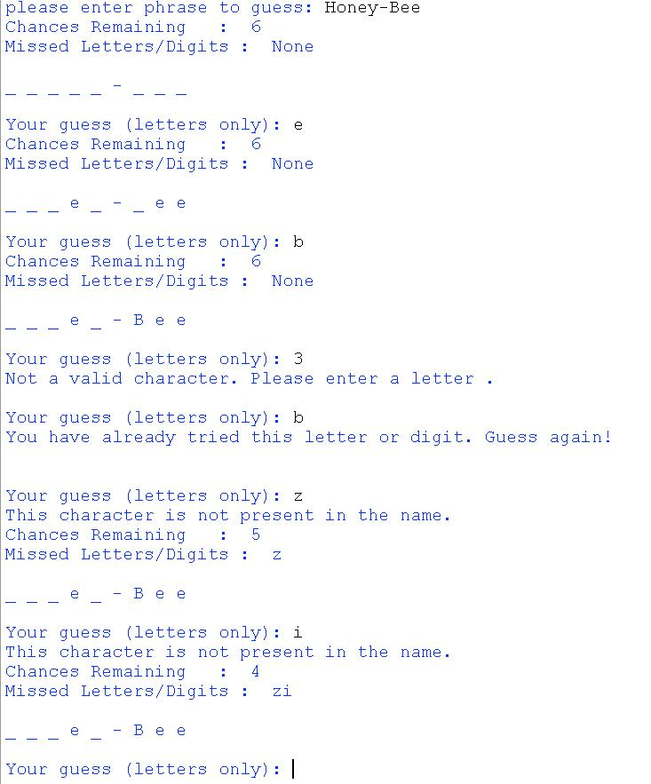

# Hangman Game

Hangman oyunu klassik tapmaca oyunudur. Onun qaydaları ilə [http://www.hangman.no/](http://www.hangman.no/) saytından tanış ola bilərsiz.

## Program Specification

1. Hangman oyunu haqda istifadəçiyə məlumat vermək
2. İstifadəçidən tapılmalı olan sözü və ya frazanı daxil etməyi tələb etmək
3. Daxil edilən string-in simvolların sayı qədər dash və space print etmək
4. İstifadəçidən ardıcıl olaraq hərf daxil etməyi tələb etmək. Əgər daxil edilən hərf tapılmalı sözdə varsa onda hərfləri öz yerlərinə qoyaraq dash və space-ləri yenidən print etmək. Əgər hərf sözdə yoxdursa onda istifadəçiyə xəbərdarlıq edərək yenidən soruşmaq
5. Hər səhv daxil edilən hərf üçün hangman şəklini çəkmək
6. Proqramda string tipinin ən azı üç built-in metodundan istifadə etmək

## Example

---

***Powered by [Elşad Ağazadənin Proqramlaşdırma Məktəbi](https://elshadaghazade.com)***

***Originally posted by Elshad Agayev***

***Please follow instructions on how you should solve this task***