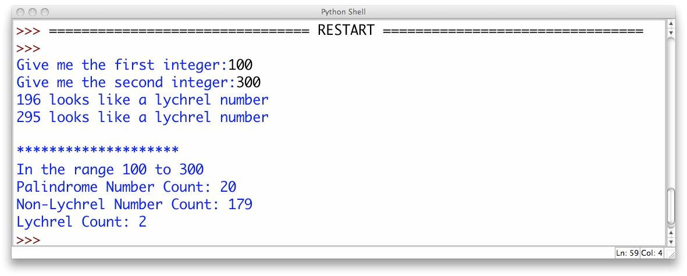

# Polindromic Integer

Bu proqram 196-alqoritmdən istifadə edərək daxil edilən ədədlərin polindrom olub olmamasını yoxlayacaq. Polindrom ədədl1ər tərsinə oxunduğu zaman eyni dəyər verən ədədlərə deyilir. Misal üçün 88, 121, 12321 və s.

196-alqoritmi aşağıdakı qaydada işləyir:

- daxil edilən inteqeri tərsinə çevirərək toplayır və alınan nəticənin polindrom olub olmamasını yoxlayır: 
    - 56: 56 + 65 = 121! polindromdur
- əgər daxil edilən ədədin tərsi ilə cəmi polindrom deyilsə onda cəmin özünü də tərsinə çevirib cəmləyirik və polindrom olub olmamasını yoxlayırıq. Bu hal polindrom rəqəm alınana qədər davam etməlidir:
    - 57: 57 + 75 = 132 polindrom deyil; 132 + 231 = 363! polindromdur
    - 87: 87+78=165 polindrom deyil; 165+561=726 polindrom deyil; 726+627=1353 polindrom deyil; 1353+3531=4884! polindromdur
    - 89: polindrom rəqəm alınana qədər 24 mərhələ keçir - 8813200023188

Bu alqoritmanın 196 adlandırılmasının səbəbi 196 ədədi **Lychrel** ədədlərdən ən birincisidir. **Lychrel** ədədlər polindrom olmayan ədədlərə deyilir. 196 ədədinin tərs cəmləri heç vaxt bizə polindrom ədəd verməyəcək. Daha ətraflı bu linkdən baxa bilərsiniz: [https://en.wikipedia.org/wiki/Lychrel_number](https://en.wikipedia.org/wiki/Lychrel_number)

## Program Specification

Sizin proqram aşağıdakıları etməlidir:

1. İstifadəçidən iki inteqer daxil etməsini tələb etməlidir. Əgər səhv daxil edildikdə xəbərdarlıq edərək yenidən soruşmalıdır. Bu hal doğru cavab daxil edilənə qədər davam etməlidir.
2. Daha sonra bu aralıqda olan (inkluziv) ədədlərin statistikasını çıxartmalısınız:
    - natural polindrom rəqəmlərin sayını (natural polindrom rəqəmlər 11, 121, 3553 və s.)
    - non-Lychrel rəqəmlərin sayını çıxarmalıdır
    - Lychrel rəqəmlərin sayını çıxarmalıdır (maksimum 60 mərhələ hesablama edərək rəqəmin Lychrel olmağını tapa bilərsiniz)
    - Lychrel rəqəmlər çox az olduğundan onlar tapıldıqca həmən rəqəmləri də çıxarın

## Example

---

***Powered by [Elşad Ağazadənin Proqramlaşdırma Məktəbi](https://elshadaghazade.com)***

***Originally posted by Elshad Agayev***

***Please follow instructions on how you should solve this task***