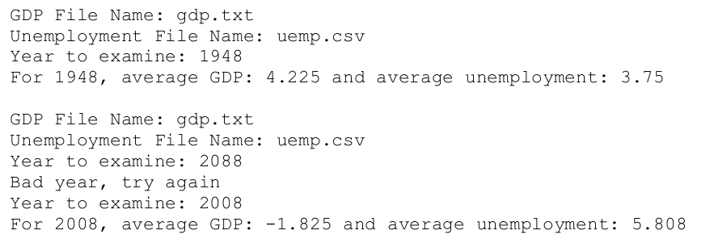
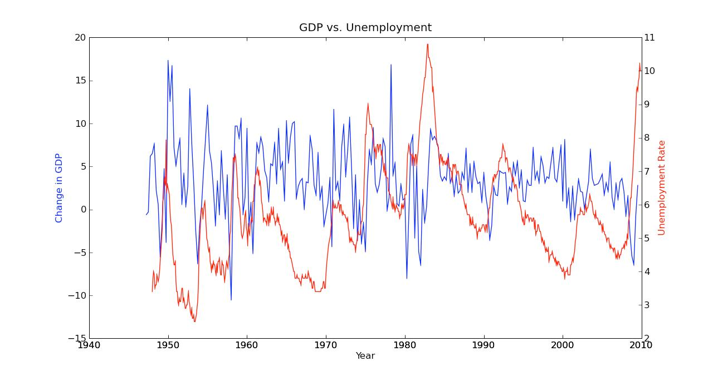

# GDP vs Employment

İqtisadiyyatda Gross Domestic Product (GDP) ölkələrin istehsalat gücünün göstəricisidir. Bu göstəriciyə əsasən iqtisadiyyatçılar ölkənin iqtisadiyyatının vəziyyətini təyin edirlər. İşsizlik dərəcəsi isə digər göstəricidir, bu iqtisadiyyatın nə qədər gerilədiyinin göstəricisidir. Sizin proqram [gdp.txt](./gdp.txt) və [unemp.csv](./unemp.csv) fayllarından istifadə edərək 1948-2008-ci illər arasında olan GDP və işsizlik statistikasını çıxarmalıdır.

## Program Specification

Sizin proqram aşağıdakıları etməlidir:

1. İstifadəçiyə proqram haqda məlumat vermək
2. İstifadəçiyə faylların siyahısını çıxartmaq
3. İstifadəçidən il daxil etməsini istəmək
4. Əgər il 1948-2008 arasında deyilsə onda bu barədə istifadəçini xəbərdar edərək yenidən daxil etməsini istəmək. Bu hal il doğru daxil edilənə qədər davam etmək
5. Daha sonra həmən il üçün istifadəçiyə ortalama (average) GDP və işsizlik qiymətlərini göstərmək
6. İstifadəçiyə bütün illərin statistikası haqda qrafik çıxarmaq

## Program Notes:

Qrafik qurmaq üçün [matplotlib](https://matplotlib.org/) modulunu araşdırın

## Example:

