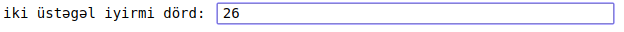

# Banking

Bu proqram kiçik bank proqramını imitasiya edəcək. Proqram müştəri bazası, pul köçürmələri və s. əməliyyatları dəstəkləməlidir

## Prerequisites

Bu proqramda istifadə edilməli modullar və texnologiyalar:

- inquirer modulu
- terminaltables modulu
- dotenv modulu
- dicitonaries, lists, tuples and sets

## Assignment Specification

Sizin proqramın iki növ istifadəçisi var:

1. Super user
2. Müştəri

Superuser xüsusi loqin və şifrə ilə sistemə daxil olaraq yeni istifadəçi artıra və ya silə bilər.

Müştəri öz müştəri kodu və şifrəsi ilə sistemə daxil olaraq öz hesabına baxa bilər, hesabına pul əlavə edə bilər, hesabından pul çəkə bilər və ya öz hesabından başqa müştərinin hesabına pul köçürməsi edə bilər. Etdiyi bütün transaksiyaların tarixçəsinə də baxa bilər.

## Program Specification

Siz **.env** faylı yaradaraq orada super istifadəçinin konfidensial məlumatlarını, login və şifrəsini saxlamalısınız.

Daha sonra sizin proqram aşağıdakıları etməlidir:

1. istifadəçidən onun kateqoriyasını daxil etməsini istəməlidir. Kateqoriyalar **s** (super) və ya **c** (customer) ola bilər.
2. Əgər istifadəçi **s** kateqoriyası seçərsə onda:
    1. istifadəçidən login və şifrəsini soruşmalı. Daxil etdikdən sonra onu .env faylındakı məlumatlarla qarşılaşdırmalıdır. Əgər uyğun gəlsə onda isifadəçi sistemə giriş etmiş sayılır. Əks halda ondan bir daha login və şifrəni daxil etməsini tələb etmək. Lakin bu hal 1 dəqiqə ərzində üç dəfədən artıq təkrarlanarsa bu kiber hücum ola bilər. Bu səbəbdən də təhlükəsizliyi artırmaq üçün istifadəçidən login və şifrədən əlavə söz ilə arifmetik hesablama soruşmaq. Misal üçün: 
    Əgər istifadəçi şifrəni doğru daxil edərsə onda həmən istifadəçi üçün sessiya yaradaraq onu ***environment***-də saxlamaq. Bununla da istifadəçinin sistemdə qalması təmin olunacaq.
    2. super istifadəçiyə edə biləcəyi variantları təqdim etmək:
        - istifadəçilərin siyahısına bax - bütün istifadəçilərin siyahısını səhifə səhifə cədvəldə göstərmək, hər səhifədə 10 istifadəçi ola bilər.
        - istifadəçi əlavə et
        - sistemdən çıx - environment-dən sessiya silinməlidir

3. Əgər istifadəçi **c** kateqoriyası seçərsə onda:
    1. istifadəçidən müştəri kodunu və şifrəsini soruşmalı. Daxil etdikdən sonra onu istifadəçilərin siyahısından axtarıb taparaq qarşılaşdırmalıdır. Əgər yalnış olarsa onda istifadəçidən təkrar daxil etməsini tələb etməlidir. Əgər bu hal üç dəfədən çox təkrarlanarsa onda bu kiber hücum ola bilər. Bu səbəbdən də təhlükəsizliyi artırmaq üçün istifadəçidən login və şifrədən əlavə söz ilə arifmetik hesablama soruşmaq. Misal üçün: 
    Əgər istifadəçi şifrəni doğru daxil edərsə onda həmən istifadəçi üçün sessiya yaradaraq onu ***environment***-də saxlamaq. Bununla da istifadəçinin sistemdə qalması təmin olunacaq.
    2. Müştəriyə aşağıdakı seçimləri vermək:
        - balansını yoxla
        - balansında pul əlavə et
        - balansından pul çək
        - digər müştərinin balansına pul yolla
        - sistemdən çıx